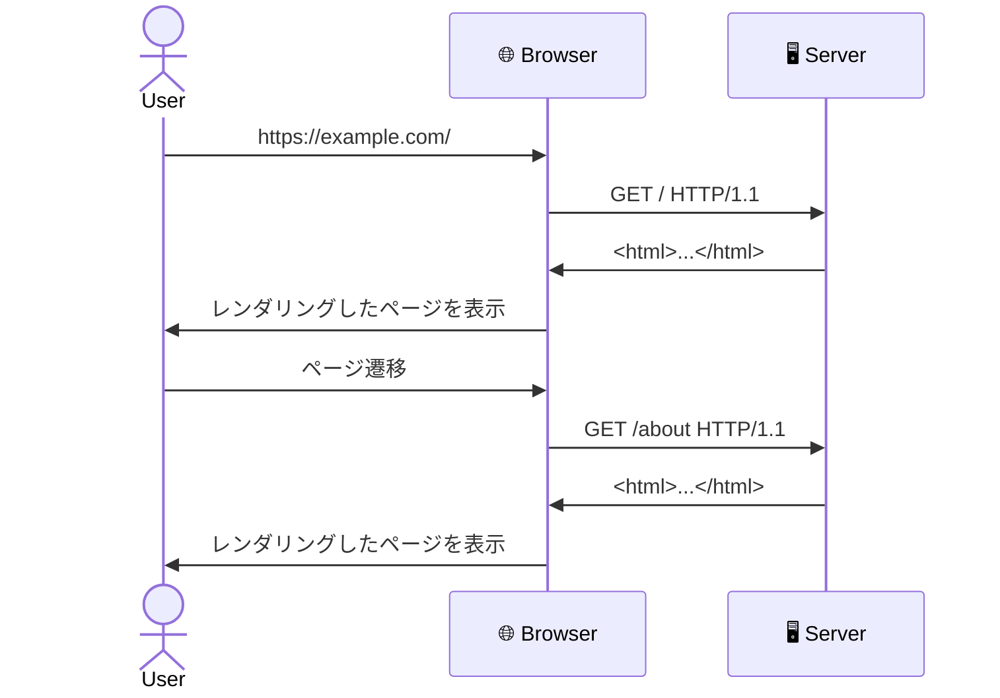
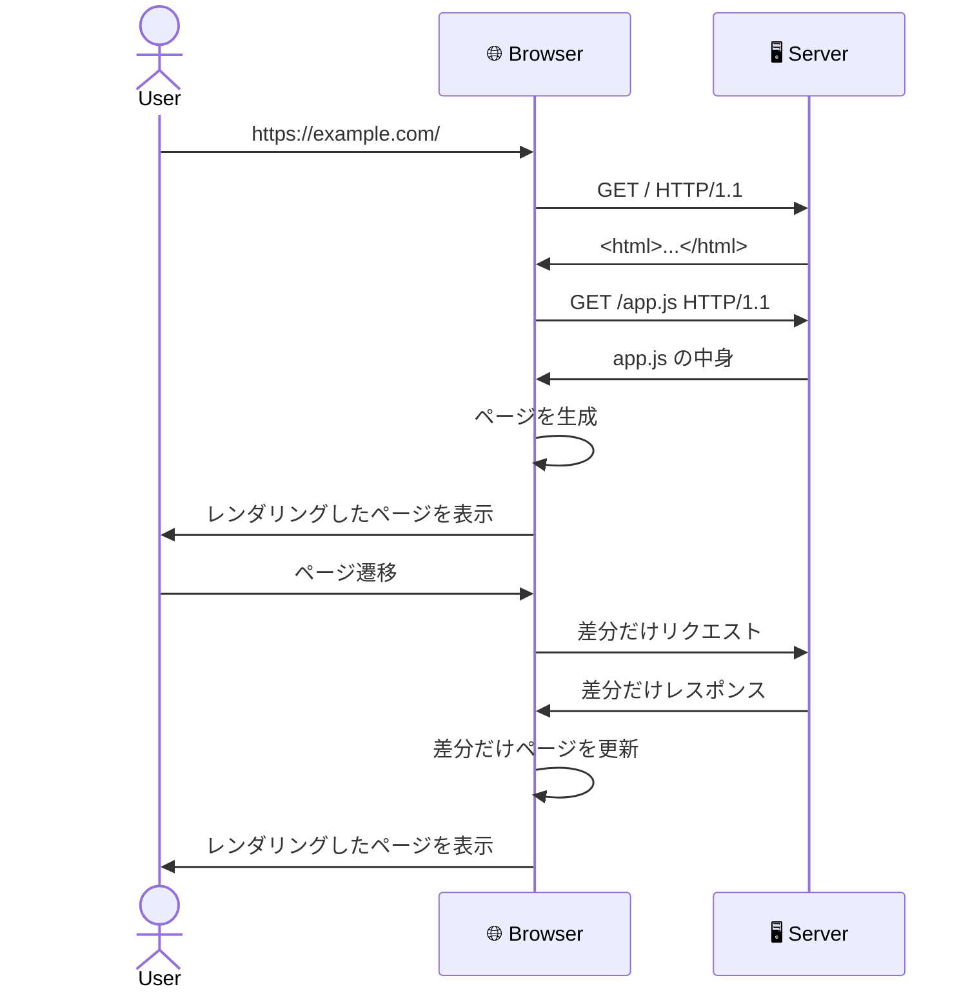
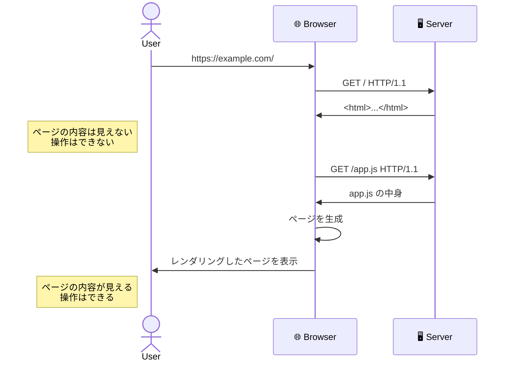
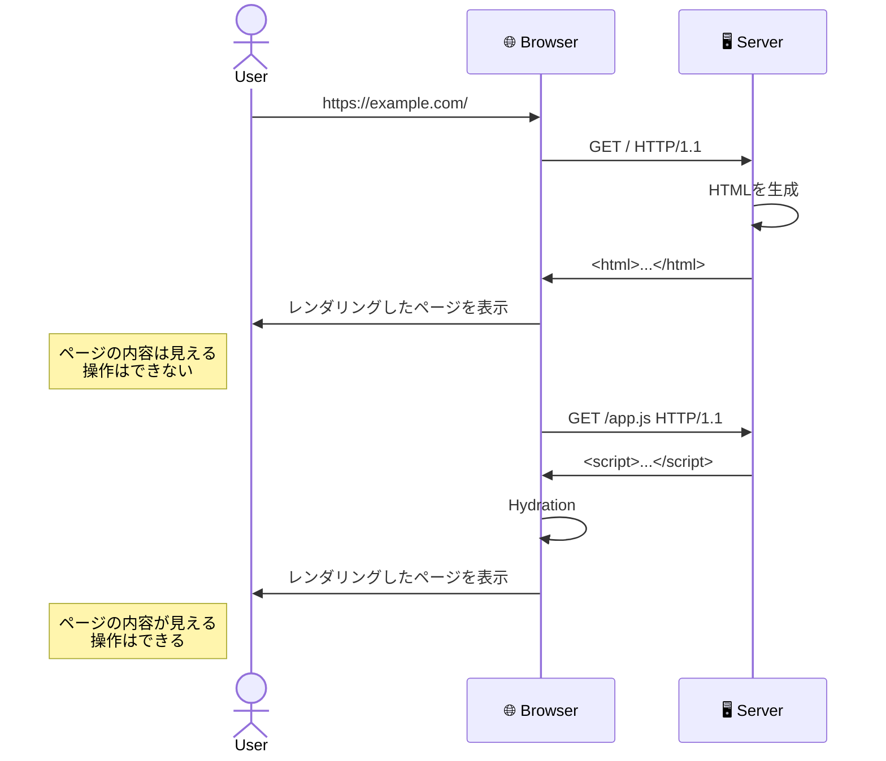
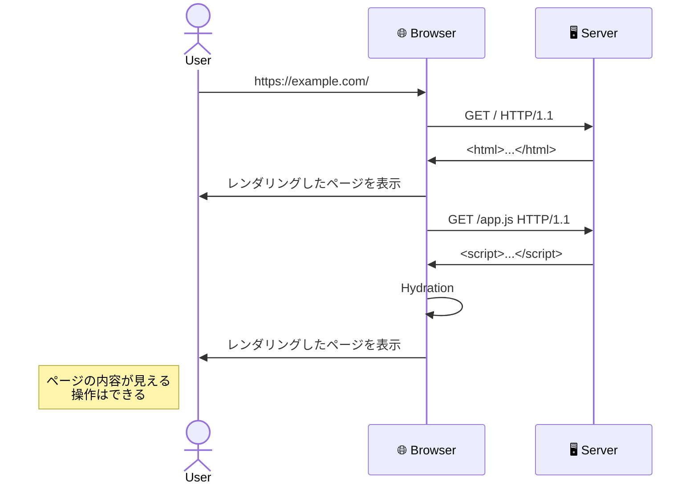

# SPA の概要

---

# Webページが表示されるまでの大まかな道のり

1. User が Web ブラウザに URL を入力する。
2. ブラウザは与えられたアドレスに対して、リクエストを送信する。
3. サーバーはリクエストを受け取り、HTML をレスポンスとして返す。
4. ブラウザは受け取った HTML を解釈し、レンダリングする。

> この説明はかなりざっくりしているので、詳しくはこちらを参照：<https://web.dev/howbrowserswork/>

---

## layout: two-cols

# SPA と MPA / MPA とは

- MPA: Multi Page Application
  - 複数のHTMLページで構成されるWebサイトのこと。
  - MPAでは、新しいページへ移動するとブラウザがサーバーに対して新しいページのHTMLをリクエストする。
- 代表的なMPAフレームワーク:
  - Ruby on Rails, Django, Laravel, Hugo, Astro, etc...

::right::

---

# SPA と MPA / SPA とは

- SPA: Single Page Application
  - ローカルでHTMLをレンダリングする単一のJavaScriptアプリケーションで構成されるWebサイトのこと。
  - SPAでは、ページ遷移をするとJSが実行され、同じHTMLで新しいHTMLのページを再描画する。
  - スムーズが画面遷移を実現するため、動的なWebサイトに適している。
  - e.g. GoogleMap, Discord, etc...
- 代表的なSPAフレームワーク:
  - SvelteKit, SolidStart, Next.js, etc...

---

## layout: two-cols

# SPA と MPA / SPA の特徴

- 初回のページ表示が遅い。
- しかし、その後のページ遷移は高速。

 

- このような、クライアント側でページをレンダリングする手法を **CSR** (Client Side Rendering) と呼ぶ。

<v-click>

- この初回ページの表示が遅いという問題を解決するために、以下のような手法が考案された。
  - SSR (Server Side Rendering)
  - SSG (Static Site Generation)

</v-click>

::right::

---

## layout: two-cols

# CSR (Client Side Rendering)

1. リクエストが来ると、空のHTMLを返す。
2. ブラウザ上でJavaScriptが実行され、HTMLの中身を生成する。

 

- 問題点:
  - 初回のページ表示が遅い。

::right::

---

## layout: two-cols

# SSR (Server Side Rendering)

1. リクエストが来ると、サーバー側でHTMLを生成して返す。
2. 仮の見た目として、インタラクティブな操作はできないHTMLが表示する。
3. JavaScriptを実行し、インタラクティブな操作を可能にする。

 

- 問題点:
  - リクエスト時に毎回HTMLを生成するため、サーバーの負荷が高くなる。
  - 実際にインタラクティブなページが表示されるのは、JavaScriptが実行されてから。

::right::

---

## layout: two-cols

# SSG (Static Site Generation)

1. ビルド時にHTMLを生成しておく。
2. リクエストが来ると、生成済みのHTMLを返す。

 

- 問題点:
  - ビルド時にHTMLを生成しておくため、コンテンツが更新されるたびにビルドしなければならない。

::right::

---

# SPA (CSR) vs MPA (SSR)

| 性能       | SPA (CSR) | MPA (SSR) |
| ---------- | --------- | --------- |
| 初回表示   | 遅い      | 速い      |
| ページ遷移 | 速い      | 遅い      |
